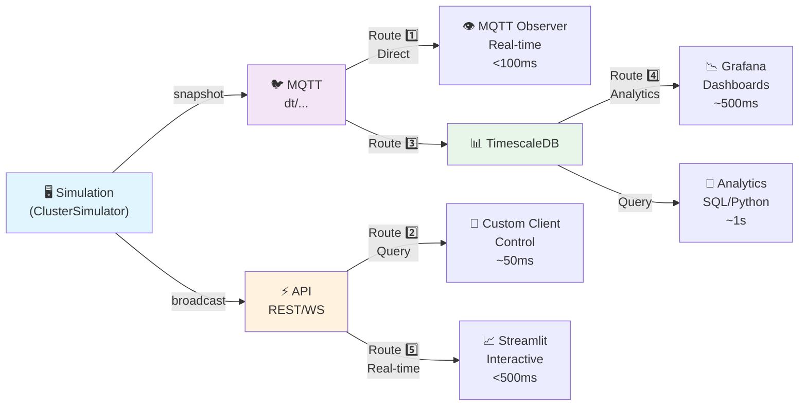

# 📊 Jumeaux Chauds — Résumé des Flux de Données

> Synthèse visuelle des 5 routes de télémétrie avec décision rapide.

---

## 🎯 5 Routes de données (Overview)



---

## Route 1️⃣ : MQTT Direct

```
Simulation → MQTT Publisher → Mosquitto → MQTT Subscriber
```

**Use case:** Real-time monitoring, inspect messages  
**Tools:** `mosquitto_sub`, MQTT Explorer, `mqtt_observer.py`  
**Latency:** <100ms  
**Persistence:** ❌ No  

```bash
mosquitto_sub -h localhost -t "dt/cluster_alpha/+/telemetry" -v
```

---

## Route 2️⃣ : API REST

```
Simulation → FastAPI (cached snapshot) → HTTP Client
```

**Use case:** Control commands, query-based access  
**Tools:** curl, Postman, custom SDK  
**Latency:** ~50ms  
**Persistence:** ❌ No (in-memory)  

```bash
curl http://localhost:8000/cluster/status
curl -X POST http://localhost:8000/machines/srv-master-01/power \
  -d '{"power_on": true}'
```

---

## Route 3️⃣ : MQTT → TimescaleDB

```
MQTT → Consumer (asyncpg) → TimescaleDB (hypertable)
```

**Use case:** Historical analysis, time-series queries  
**Tools:** SQL queries, custom analytics  
**Latency:** ~1s (batch inserts)  
**Persistence:** ✅ Yes (hypertable)  

```sql
SELECT * FROM telemetry 
WHERE machine_id = 'srv-master-01' 
  AND time > NOW() - INTERVAL '24 hours'
ORDER BY time DESC
LIMIT 100;
```

---

## Route 4️⃣ : TimescaleDB → Grafana

```
TimescaleDB → Grafana (SQL queries) → Dashboard
```

**Use case:** Executive dashboards, SLA tracking  
**Tools:** Grafana UI  
**Latency:** ~500ms (query + render)  
**Persistence:** ✅ Yes (stored)  

**Dashboard features :**
- Time-series graphs
- Heatmaps
- Alerts & annotations
- Custom panels

---

## Route 5️⃣ : Streamlit + WebSocket

```
Simulation → FastAPI WebSocket → Streamlit UI
```

**Use case:** Interactive control, real-time dashboard  
**Tools:** Streamlit app  
**Latency:** <500ms  
**Persistence:** ❌ No (UI state)  

```python
# dashboard/app.py
client = get_ws_client()
snapshot = client.get_latest()
st.metric("Avg Temp", f"{snapshot['avg_temp']:.1f}°C")
```

---

## ✅ Decision Matrix

| Need | Choose | Reason |
|------|--------|--------|
| **See raw MQTT messages** | Route 1️⃣ | Inspect payload, debug topics |
| **Send control commands** | Route 2️⃣ | REST API, stateless, OpenAPI |
| **Interactive dashboard** | Route 5️⃣ | Real-time + buttons/sliders |
| **Store & analyze history** | Route 3️⃣ | TimescaleDB persistence |
| **Executive reports** | Route 4️⃣ | Pre-computed, SLA ready |
| **Custom integration** | Route 2️⃣ | REST + webhooks, easy SDK |
| **Multiple subscribers** | Route 1️⃣ | MQTT pub/sub, scalable |

---

## 🚀 Quick Start (5 routes in parallel)

```bash
# Terminal 1 : Broker
docker run -d --name mosquitto -p 1883:1883 eclipse-mosquitto:2

# Terminal 2 : Simulation
python scripts/run_simulator.py --scenario nominal --duration 10m

# Terminal 3 : Route 1️⃣ (MQTT Observer)
python scripts/mqtt_observer.py --host localhost --topics "dt/+/+/telemetry"

# Terminal 4 : Route 2️⃣ (API)
export MQTT_ENABLED=0
uvicorn api.main:app --port 8000
# → http://localhost:8000/docs

# Terminal 5 : Route 5️⃣ (Streamlit Dashboard)
streamlit run dashboard/app.py
# → http://localhost:8501

# Routes 3️⃣ & 4️⃣ require Docker Compose with storage profile
# docker compose --profile storage up -d
```

---

## 📊 Comparison Table

| Metric | Route 1 | Route 2 | Route 3 | Route 4 | Route 5 |
|--------|---------|---------|---------|---------|---------|
| **Latency** | <100ms | ~50ms | ~1s | ~500ms | <500ms |
| **Realtime?** | ✅ | ✅ | ❌ | ❌ | ✅ |
| **Persistent?** | ❌ | ❌ | ✅ | ✅ | ❌ |
| **Interactive?** | ❌ | ✅ | ❌ | ❌ | ✅ |
| **Scalable?** | ✅ | ✅ | ✅ | ✅ | ⚠️ |
| **Setup time** | 5 min | 5 min | 30 min | 30 min | 5 min |
| **Complexity** | Low | Low | Med | Med | Low |

---

## 🔀 Hybrid Patterns

**Pattern A : Developer Testing**
- Route 1️⃣ (mosquitto_sub to log)
- Route 2️⃣ (curl for commands)

**Pattern B : Real-time Monitoring**
- Route 1️⃣ (MQTT Explorer)
- Route 5️⃣ (Streamlit dashboard)

**Pattern C : Production Stack**
- Route 1️⃣ (MQTT broker only)
- Route 3️⃣ (Consumer → TimescaleDB)
- Route 4️⃣ (Grafana dashboards)
- Route 5️⃣ (Streamlit for ops)

**Pattern D : Custom Integration**
- Route 2️⃣ (REST API)
- Route 3️⃣ (Query TimescaleDB)

---

## 📖 Full Documentation

See [`documents/TELEMETRY_FLOWS.md`](TELEMETRY_FLOWS.md) for:
- Detailed sequence diagrams
- Code examples
- Error handling
- Performance benchmarks
- Layer-by-layer implementation

---

*Reference card — print for quick lookup while developing!*
