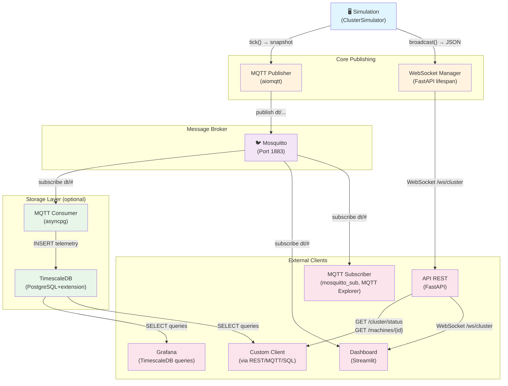
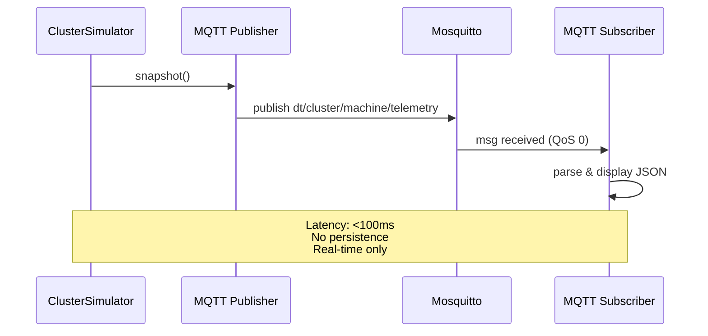
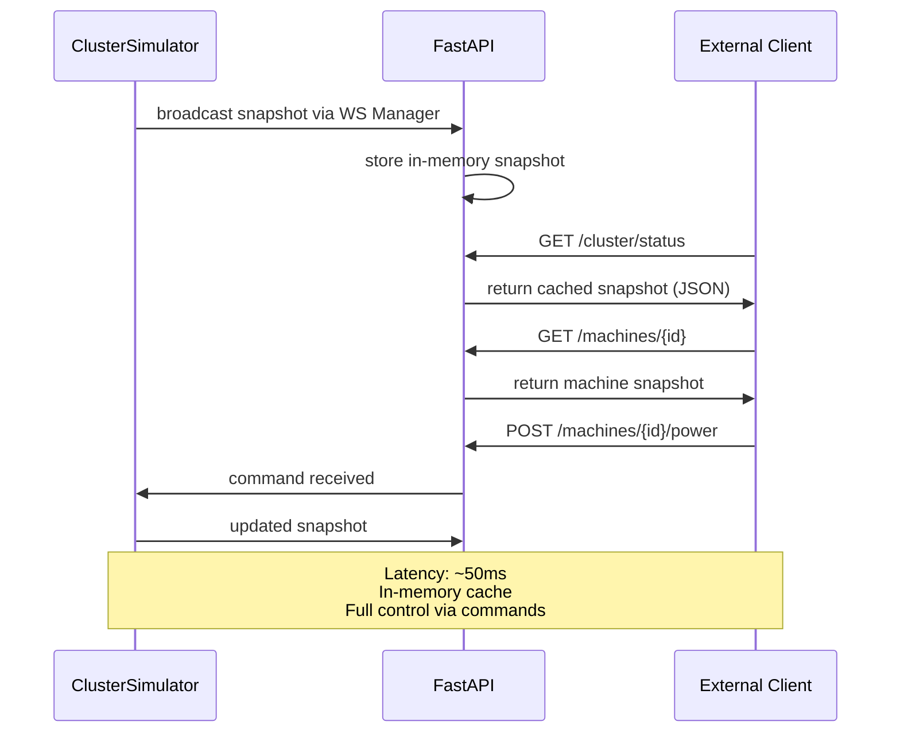
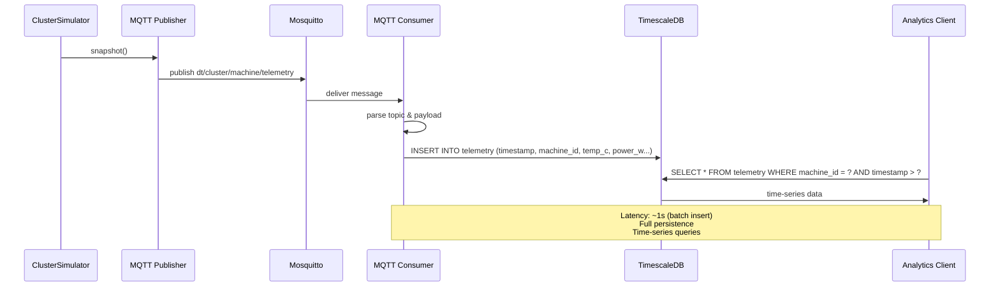
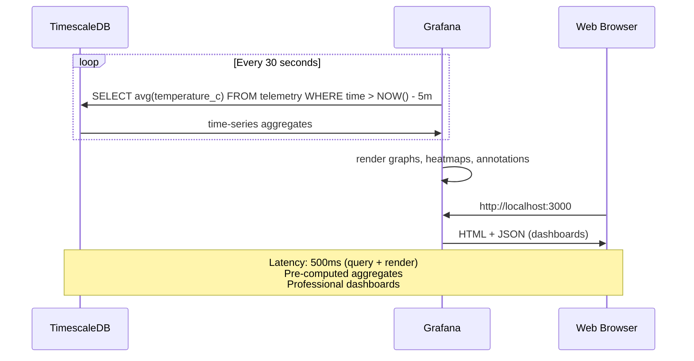
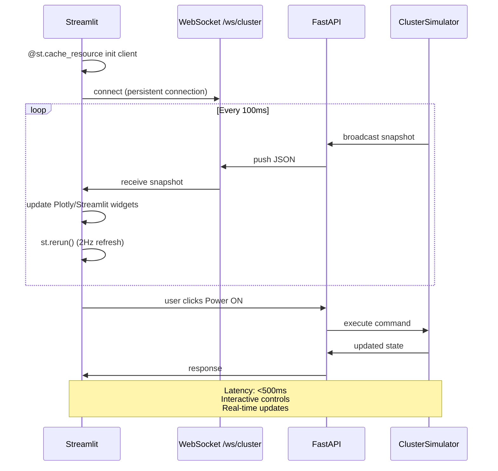
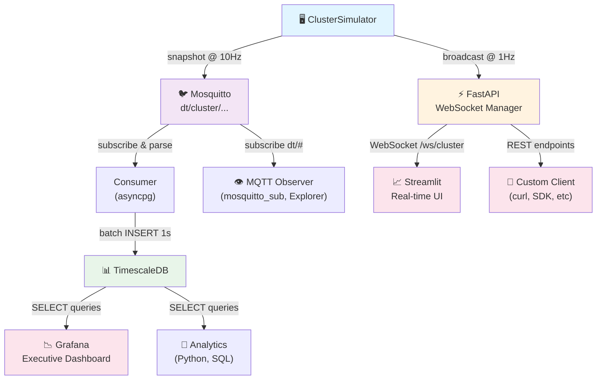
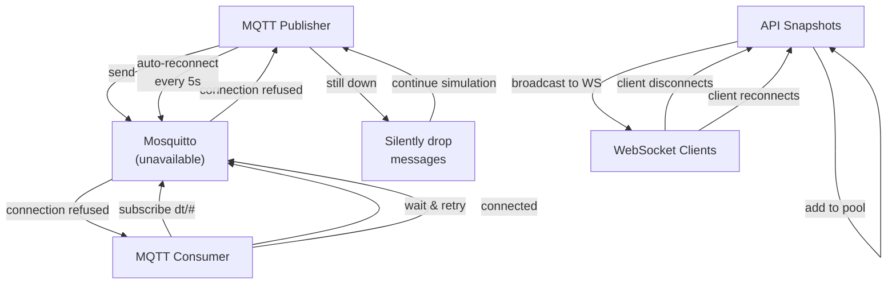

# 📊 Flux de Télémétrie — Jumeaux Chauds

> **Document :** Routes de données de télémétrie entre les machines simulées et les clients externes.

Cet document mappe tous les trajets possibles pour extraire les données de télémétrie d'une machine, depuis la simulation jusqu'au client consommateur final.

---

## 1. Vue d'ensemble des flux



---

## 2. Routes de télémétrie détaillées

### Route 1️⃣ : MQTT Direct (Real-time, Lightweight)



**Caractéristiques :**
- **Latency** : <100 ms
- **Persistence** : ❌ Non (data lost if subscriber disconnects)
- **Ideal for** : Real-time monitoring, dashboards, streaming
- **Tools** : `mosquitto_sub`, MQTT Explorer, `mqtt_observer.py`
- **Format** : JSON payloads on topics `dt/{cluster}/{machine}/{kind}`

**Example :**
```bash
# Subscribe
mosquitto_sub -h localhost -t "dt/cluster_alpha/srv-master-01/telemetry" -v

# Output
dt/cluster_alpha/srv-master-01/telemetry {"id":"srv-master-01","temperature_c":42.5,"power_w":180.3,...}
```

---

### Route 2️⃣ : API REST (Query-based, Stateful)



**Caractéristiques :**
- **Latency** : ~50 ms
- **Persistence** : ❌ Non (cache in-memory, lost on restart)
- **Ideal for** : Control commands, web dashboards, query-based clients
- **Features** : Full REST API, WebSocket streaming, OpenAPI docs
- **Format** : JSON responses, HTTP status codes

**Example :**
```bash
# Query snapshot
curl http://localhost:8000/cluster/status

# Send command
curl -X POST http://localhost:8000/machines/srv-master-01/power \
  -H "Content-Type: application/json" \
  -d '{"power_on": true}'

# WebSocket real-time
wscat -c ws://localhost:8000/ws/cluster
```

---

### Route 3️⃣ : MQTT → TimescaleDB (Persistent, Analytical)



**Caractéristiques :**
- **Latency** : ~1 second (batch inserts)
- **Persistence** : ✅ Oui (hypertable with continuous aggregation)
- **Ideal for** : Historical analysis, trends, long-term storage
- **Features** : Time-series compression, retention policies, aggregation
- **Format** : PostgreSQL table `telemetry` with timestamp index

**Schema :**
```sql
CREATE TABLE telemetry (
    time TIMESTAMPTZ NOT NULL,
    cluster_id TEXT NOT NULL,
    machine_id TEXT NOT NULL,
    temperature_c FLOAT NOT NULL,
    power_w FLOAT NOT NULL,
    energy_kwh FLOAT,
    fan_rpm_mean INT,
    status TEXT
);

SELECT * FROM telemetry 
WHERE machine_id = 'srv-master-01' 
  AND time > NOW() - INTERVAL '1 hour'
ORDER BY time DESC;
```

---

### Route 4️⃣ : TimescaleDB → Grafana (Visualization, Dashboards)



**Caractéristiques :**
- **Latency** : ~500 ms (query + render)
- **Persistence** : ✅ Oui (stored in TimescaleDB)
- **Ideal for** : Executive dashboards, SLA monitoring, alerts
- **Features** : Custom panels, annotations, alerting rules
- **Format** : SQL queries, time-series response

**Example Query :**
```sql
-- Average temperature per machine (last 24h)
SELECT 
  time_bucket('5 min', time) as bucket,
  machine_id,
  avg(temperature_c) as avg_temp
FROM telemetry
WHERE time > NOW() - INTERVAL '24 hours'
GROUP BY bucket, machine_id
ORDER BY bucket DESC;
```

---

### Route 5️⃣ : Streamlit Dashboard (Interactive Monitoring)



**Caractéristiques :**
- **Latency** : <500 ms
- **Persistence** : ❌ Non (UI state ephemeral)
- **Ideal for** : Interactive control, real-time monitoring, admin dashboards
- **Features** : Buttons, sliders, live plots, multi-tab interface
- **Connection** : WebSocket for continuous streaming

**Example :**
```python
# In dashboard/app.py
@st.cache_resource
def get_ws_client():
    return ClusterWSClient("ws://localhost:8000/ws/cluster")

client = get_ws_client()
snapshot = client.get_latest()  # Last snapshot from WebSocket

st.metric("Avg Temperature", f"{snapshot['avg_temp']:.1f}°C")
st.button("Power ON", on_click=api_client.power_on)
```

---

## 3. Matrice comparée : Routes vs Cas d'usage

| Critère | MQTT Direct | API REST | MQTT→TSDB | TSDB→Grafana | Streamlit |
|---------|------------|----------|-----------|--------------|-----------|
| **Latency** | <100ms | ~50ms | ~1s | ~500ms | <500ms |
| **Persistence** | ❌ | ❌ | ✅ | ✅ | ❌ |
| **Real-time** | ✅ | ✅ | ❌ | ❌ | ✅ |
| **History** | ❌ | ❌ | ✅ | ✅ | ❌ |
| **Scalability** | ✅ (pub/sub) | ✅ (stateless) | ✅ (DB) | ✅ (cached) | ⚠️ (UI) |
| **Control** | ❌ | ✅ | ❌ | ❌ | ✅ |
| **Dashboards** | ⚠️ (custom) | ⚠️ (code) | ✅ | ✅ | ✅ |
| **Cost** | Low | Low | Medium | Low | Low |
| **Setup** | 5 min | 5 min | 30 min | 30 min | 5 min |

---

## 4. Flux hybride recommandé (production)



**Bénéfices :**
- ✅ Real-time MQTT pour monitoring immédiat
- ✅ API pour contrôle & requêtes ponctuelles
- ✅ TimescaleDB pour historique & analytics
- ✅ Grafana pour dashboards pro
- ✅ Streamlit pour UI interactive
- ✅ Scalable & modular

---

## 5. Points de décision

### Quel flux choisir ?

| Cas d'usage | Route recommandée | Raison |
|-------------|------------------|--------|
| **Monitoring temps réel** | MQTT Direct (Route 1) | Faible latence, pas d'overhead DB |
| **Contrôle machine** | API REST (Route 2) | Commands, stateless |
| **Dashboard admin interactif** | Streamlit (Route 5) | UI riche, WebSocket push |
| **Analyse historique** | MQTT→TSDB→Query (Routes 3) | Agrégations, time-series |
| **Executive reporting** | TSDB→Grafana (Route 4) | Pre-computed, SLA tracking |
| **Custom integration** | API REST (Route 2) | OpenAPI docs, easy SDK |
| **Debugging & inspection** | MQTT Direct (Route 1) | See raw messages immediately |

### Combinaisons possibles

**Scenario 1 : Fast monitoring**
```
Sim → MQTT → MQTT Explorer (inspect)
Sim → API → Streamlit (interactive)
```

**Scenario 2 : Full stack**
```
Sim → MQTT → Consumer → TimescaleDB → Grafana (history)
Sim → API → Streamlit (real-time control)
```

**Scenario 3 : Developer testing**
```
Sim → MQTT → mosquitto_sub (log to file)
Sim → API → curl / Postman (manual tests)
```

---

## 6. Implémentation par couche

### Layer 6.1 : Publication (Simulation → Broker)

**Files :** `simulation/cluster.py`, `mqtt/publisher.py`

```python
# In cluster.py during run()
async def run():
    while True:
        for machine in self.machines.values():
            machine.tick(load_factor=..., dt=...)
        
        # Publish to MQTT
        if self.publisher:
            await self.publisher.publish_telemetry(self.machines)
        
        # Broadcast via WebSocket
        if self.ws_manager:
            self.ws_manager.broadcast(self.get_snapshot())
        
        await asyncio.sleep(1.0 / self.tick_rate_hz)
```

### Layer 6.2 : MQTT Subscriber (Broker → Consumer)

**Files :** `consumer/mqtt_to_timescale.py`

```python
async def run():
    async with aiomqtt.Client(broker_host, broker_port) as client:
        await client.subscribe("dt/#")
        async for message in client.messages:
            # Parse topic: dt/cluster/machine/kind
            cluster, machine, kind = parse_topic(message.topic)
            
            # Parse payload
            data = json.loads(message.payload)
            
            # Dispatch to handler
            if kind == "telemetry":
                await insert_telemetry(pool, cluster, machine, data)
            elif kind in ["fault", "status"]:
                await insert_event(pool, cluster, machine, kind, data)
```

### Layer 6.3 : API Endpoints (Simulation → HTTP)

**Files :** `api/main.py`, `api/routes/`

```python
@app.get("/cluster/status")
async def get_cluster_status(cluster: ClusterSimulator = Depends(get_cluster)):
    """Return current cluster snapshot."""
    return cluster.get_snapshot()

@app.websocket("/ws/cluster")
async def websocket_cluster(websocket: WebSocket):
    """Stream cluster snapshots in real-time."""
    manager.connect(websocket)
    try:
        while True:
            # Receive snapshot from manager (pushed by cluster.run())
            await manager.broadcast(snapshot)
    finally:
        manager.disconnect(websocket)
```

### Layer 6.4 : Dashboard (API → UI)

**Files :** `dashboard/app.py`, `dashboard/ws_client.py`

```python
@st.cache_resource
def get_cluster_client():
    return ClusterWSClient("ws://localhost:8000/ws/cluster")

client = get_cluster_client()
latest = client.get_latest()

col1, col2, col3 = st.columns(3)
col1.metric("Machines ON", latest['machines_on'])
col2.metric("Avg Temp", f"{latest['avg_temp']:.1f}°C")
col3.metric("Total Power", f"{latest['total_power_w']:.0f}W")

# Heatmap
fig = px.imshow([[m['temperature_c'] for m in latest['machines'].values()]])
st.plotly_chart(fig)
```

---

## 7. Flux d'erreur & reconnexion



**Points clés :**
- ✅ Publisher tolerates broker down (doesn't block simulation)
- ✅ Consumer retries if broker unavailable
- ✅ API WebSocket handles client reconnects transparently
- ⚠️ MQTT messages lost if broker down (no local queue)
- ✅ TimescaleDB persists data once written

---

## 8. Performance & Benchmarks

| Route | Throughput | Latency | CPU | Memory |
|-------|-----------|---------|-----|--------|
| MQTT Direct (5 machines) | 50 msg/s | <100ms | <5% | <10MB |
| API REST (5 machines) | 100 req/s | ~50ms | <5% | <20MB |
| MQTT→TSDB (5 machines) | 10 msg/s (batch) | ~1s | <10% | <50MB |
| Grafana (time-bucketed) | 1 dashboard | ~500ms | <5% | <100MB |
| Streamlit (5 machines) | 2 FPS | <500ms | <15% | <150MB |

**Notes :**
- All tests: 5 machines, 10Hz simulation, 1 hour runtime
- MQTT→TSDB batches inserts (1s window)
- Grafana pre-computes aggregates (5min buckets)
- Streamlit UI refresh 2Hz (st.rerun())

---

*Tristan Vanrullen — La Plateforme, Marseille — 2026*
